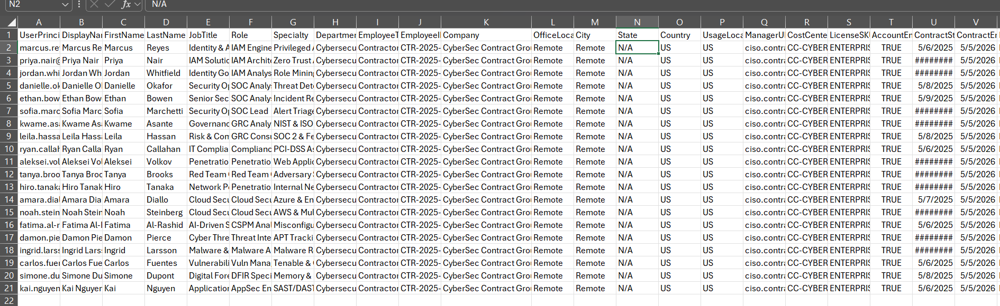
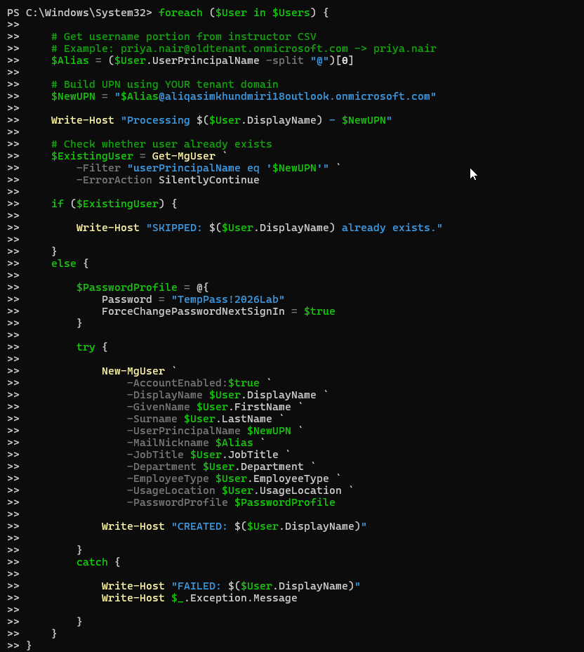
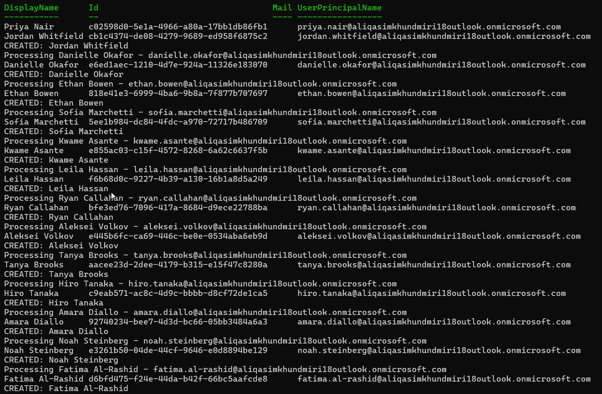
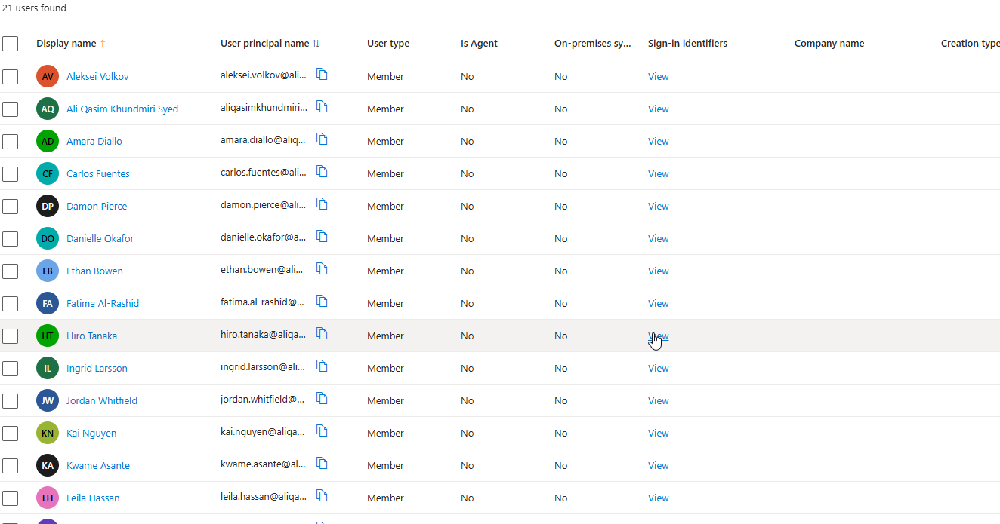
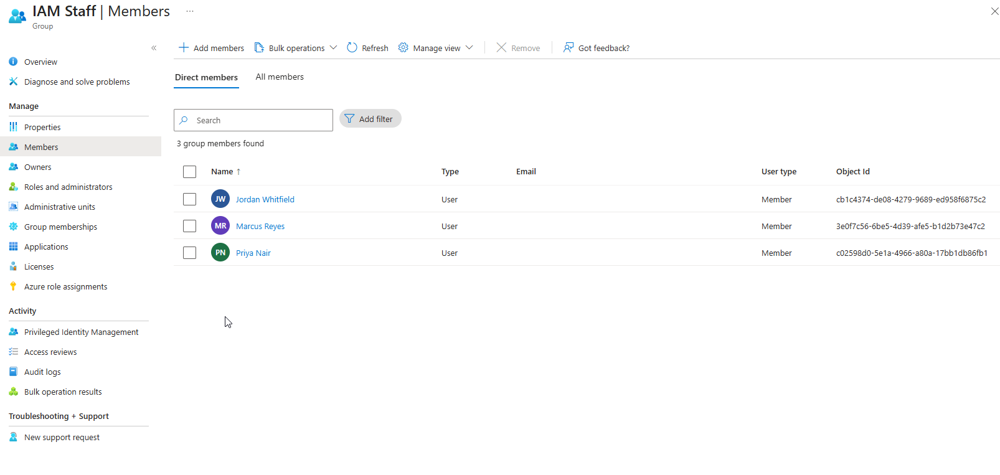
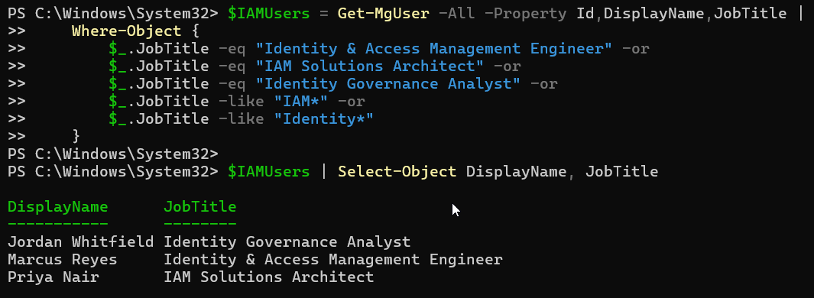
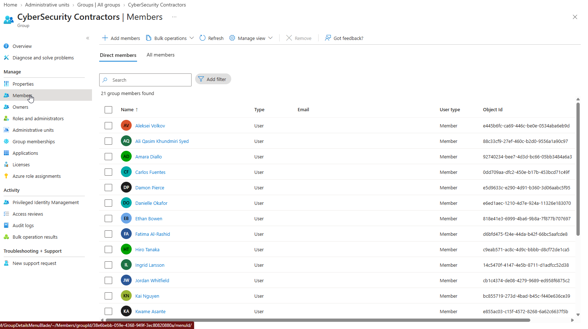
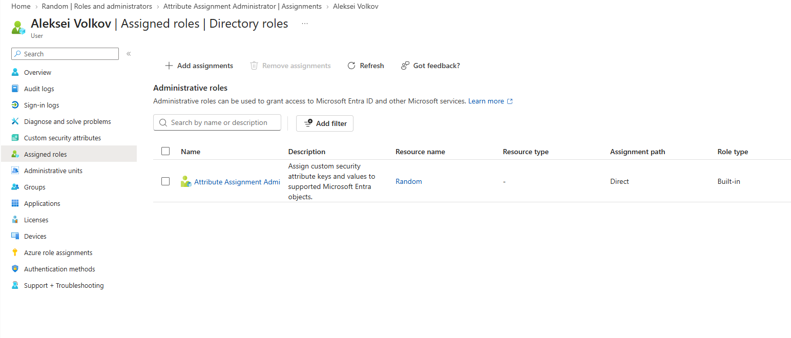

# Part 1 — Joiner & Identity Organization

## Objective

The first section of the lab focuses on the **Joiner** stage of JML: creating identities, populating attributes, organizing users, and preparing them for access assignment.

## Figure 1 — CSV Dataset with 20 Users

The onboarding source was a CSV containing 20 cybersecurity contractor personas with fields such as UPN, display name, job title, department, employee type, contract dates, and security-related metadata.

```markdown

```

The CSV represents a simplified HR/source-of-truth feed for the Joiner process.

## Figure 2 — Connect to Microsoft Graph and Bulk Provision Users

```powershell
Connect-MgGraph `
    -Scopes "User.ReadWrite.All","Group.ReadWrite.All","Domain.Read.All" `
    -ContextScope Process
```

A `foreach` loop imported each CSV row, transformed the source UPN suffix to the lab tenant, and created the user.

```markdown

```

## Figure 3 — 20 Users Successfully Created

The script output confirmed successful identity creation.

```markdown

```

## Figure 4 — Users Visible in Microsoft Entra ID

The newly provisioned accounts were verified in the Entra admin center.

```markdown

```

## Figure 5 — IAM Staff Attribute-Based Membership

A group named **IAM Staff** was created. Because the original tenant state did not support native premium dynamic-membership functionality, PowerShell was used to simulate dynamic membership by evaluating user attributes and adding matching users.

```powershell
$IAMUsers = Get-MgUser -All |
    Where-Object {
        $_.JobTitle -like "*IAM*" -or
        $_.JobTitle -like "*Identity*"
    }
```

```markdown

```

> Describe this as **PowerShell-driven attribute-based membership automation**, not native Entra dynamic membership.

## Figure 6 — PowerShell Attribute Evaluation

The PowerShell command evaluated job-title attributes and added qualifying identities to the IAM Staff group.

```markdown

```

## Figure 7 — Cybersecurity Contractors Group

A second group, **Cybersecurity Contractors**, was created and used as the common group for contractor identities.

```markdown

```

This group was later used as a target for an Access Review.

## Groups vs Administrative Units

### Group
A group is mainly used to group identities for application access, collaboration, authorization, license assignment, and access reviews.

```text
WHO should receive or share access?
```

### Administrative Unit
An Administrative Unit scopes **administrative control** to a subset of directory objects.

```text
Global tenant
|
+-- Administrative Unit: Security Contractors
      |
      +-- Selected users
      +-- Scoped administrator
```

```text
WHAT portion of the directory can this administrator manage?
```

A group gives users access together. An Administrative Unit limits where an administrator's authority applies.

## Figure 8 — Administrative Unit and Scoped Administration

An Administrative Unit was created, **Aleksei Volkov** was added, and an administrative role was scoped to that Administrative Unit.

```markdown

```

## Joiner Outcome

```text
CSV source
  -> 20 Entra identities
  -> attributes populated
  -> IAM Staff membership
  -> Cybersecurity Contractors membership
  -> Administrative Unit
  -> scoped administration
```

## Repository Scope

This repository focuses on the **Joiner** phase of the JML lifecycle:
CSV-driven provisioning, identity attributes, groups, attribute-based membership automation, and Administrative Units.

## Next Lab

Continue with the RBAC/PIM repository for role assignment and privileged access governance.
